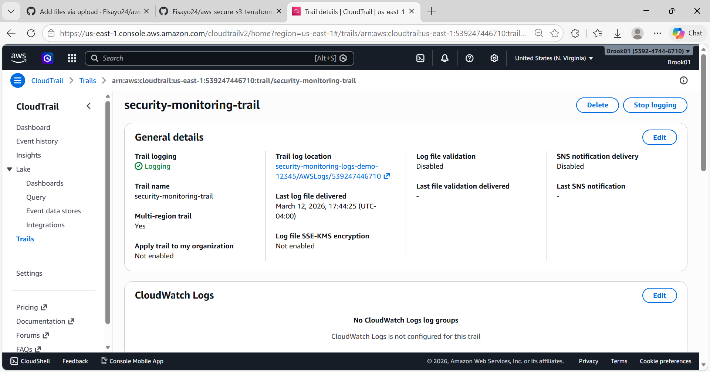
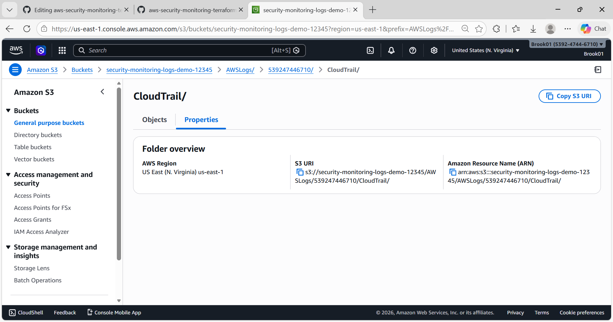

# AWS Security Monitoring with Terraform

This project deploys a security monitoring environment in AWS using Terraform.

## Services Used

- Amazon GuardDuty
- AWS CloudTrail
- Amazon SNS
- Amazon S3

## GuardDuty Dashboard

## Description

GuardDuty monitors AWS accounts for suspicious activity while CloudTrail logs API activity.  
SNS sends alerts when security findings are detected, and S3 securely stores logs.

## GuardDuty Security Findings

This screenshot shows the Amazon GuardDuty findings panel displaying detected security threats within the AWS environment. GuardDuty analyzes AWS logs and network activity to identify suspicious behavior, compromised instances, and potential data exposure. These findings help security teams quickly investigate and respond to threats.

## AWS CloudTrail Logging

AWS CloudTrail records API activity across the AWS account. These logs provide visibility into user actions, resource changes, and service events, helping with auditing, security monitoring, and incident investigation.

## S3 Security Log Storage

This screenshot shows the Amazon S3 bucket used to securely store CloudTrail logs generated within the AWS environment. Centralized log storage enables long‑term auditing, forensic analysis, and compliance monitoring.
