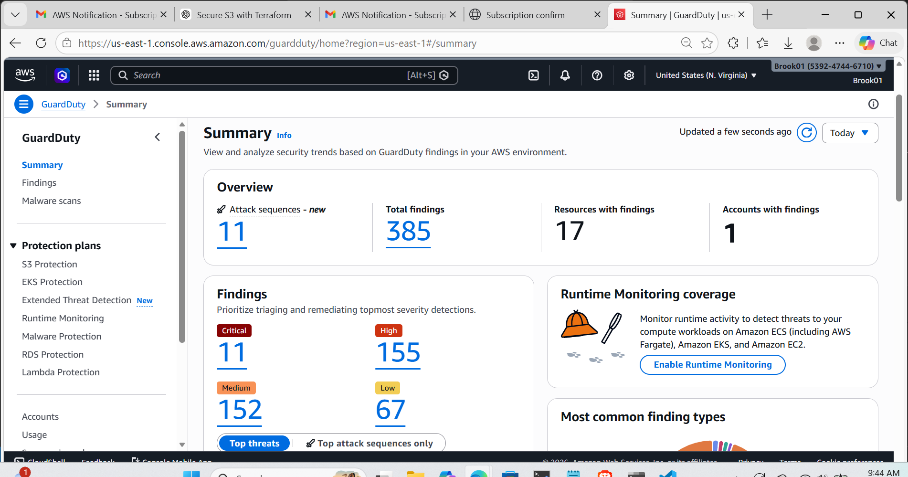
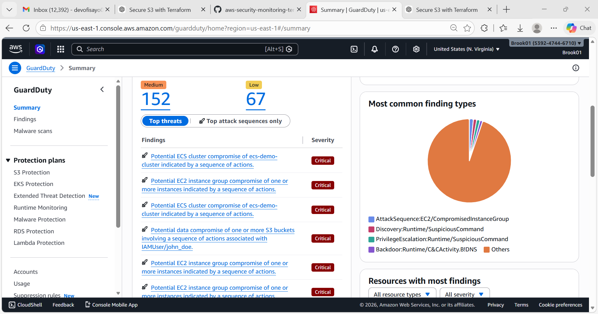

# AWS Security Monitoring with Terraform

This project deploys a security monitoring environment in AWS using Terraform.

## Services Used

- Amazon GuardDuty
- AWS CloudTrail
- Amazon SNS
- Amazon S3

## GuardDuty Dashboard

## Description

GuardDuty monitors AWS accounts for suspicious activity while CloudTrail logs API activity.  
SNS sends alerts when security findings are detected, and S3 securely stores logs.

## GuardDuty Security Findings 

## Description

This screenshot shows the GuardDuty findings panel highlighting detected security threats within the AWS environment. GuardDuty analyzes AWS logs and activity to identify suspicious behavior such as compromised instances, unusual API activity, and potential data exposure.
